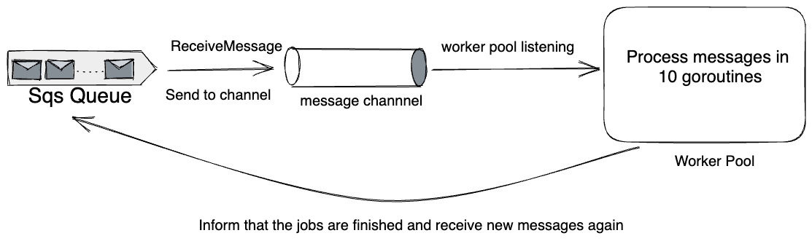

## Motivation

The motivation for me to write this blog post is that I want to have a consumer which uses goroutines for the messages received
from SQS but almost all of the posts I read was did not exactly implemented as a worker pool integration.

The posts uses new goroutines for each of the messages received and it might be useful for their case but if you process millions of 
records, creating and deleting millions of records might be a burden to garbage collector.

So in this post, 10 goroutines will listen for all of the messages received. 


This case only will work if you need to process and delete the messages from the queue in each of the 
`ReceiveMessage` call. Otherwise, it might not be useful for your case.


### Design



## Implementation

There are some things to consider.

For our case the consumer should do following steps

1. Receive message from the queue
    - it can receive at most 10 messages in one single call to sqs.
2. Send these 10 messages to the channel for workers to listen.
3. Wait for these 10 messages process to finish.
4. Release the workers so they can process again.


It might be useful for your case, so please use with care with your judgement.

###  CODE

To understand the functions and methods used here, please have a visit to [aws-sdk-go-v2/sqs](https://pkg.go.dev/github.com/aws/aws-sdk-go-v2/service/sqs)

```go

import (
    "context"
    "sync"

    "github.com/aws/aws-sdk-go-v2/aws"
	"github.com/aws/aws-sdk-go-v2/service/sqs"
	"github.com/aws/aws-sdk-go-v2/service/sqs/types"
)

type Consumer struct {
	client    sqs.Client
    queueName string
}

func (consumer *Consumer) Start(ctx context.Context) {
	params := &sqs.ReceiveMessageInput{
		AttributeNames:        []types.QueueAttributeName{types.QueueAttributeNameAll},
		MaxNumberOfMessages:   10, // max it can receive
		MessageAttributeNames: []string{string(types.QueueAttributeNameAll)},
		QueueUrl:              aws.String(consumer.queueName),
		WaitTimeSeconds:       20, // wait for 20 seconds at max for at least 1 message to be received
	}

	msgCh := make(chan types.Message)

	var wg sync.WaitGroup

	startPool(ctx, msgCh, &wg)

	for {
		select {
		case <-ctx.Done():
			close(msgCh)

			return
		default:
			resp, err := consumer.client.ReceiveMessage(ctx, params)
			if err != nil {
				log.Msg("cannot receive messages")
				continue
			}

            // add number of messages received from the queue
			wg.Add(len(resp.Messages))

            // send received messages to sqs, so they can be processed
			for _, message := range resp.Messages {
				msgCh <- message
			}

            // wait for workers in the pool to be finished.
			wg.Wait()
		}
	}
}

// startPool starts 10 goroutines which listens to the msgCh which receives the 
// messages from the SQS.
func startPool(ctx context.Context, msgCh chan types.Message, wg *sync.WaitGroup) {
	for i := 0; i < 10; i++ {
		go func() {
			for {
				select {
				case <-ctx.Done():
					return
				case msg, channelClosed := <-msgCh:
					// If the channel is closed
					if !channelClosed {
						return
					}

					// handle the message here, insert your logic.


                    // release the waitgroup to inform that the message has been processed.
					wg.Done()
				}
			}
		}()
	}
}


```

## Some Points

Let's say you are receiving 1 million daily throughput from the SQS.

- For the 10 messages you received
    - if you create 5 goroutines in each time in the end you will create 500_000 goroutines.
    - if you create 5 goroutines which listens to a channel and process those messages, then you will only create 5 goroutines.


Thanks for reading. Any feedback is appreciated.