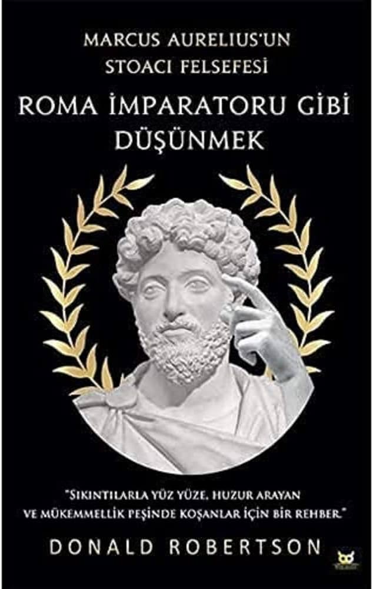


Ben bu konu hakkında uzman değilim, sadece kendi fikirlerimi beyan ediyorum.


Son zamanlarda  `Stoacılık` ile alakalı çok fazla içerik görmeye başladım. Daha sonra merak ettim
ve aslında bana da çokça uyan bir felsefi düşünce olduğunu gördüm. Bunla alakalı meşhur bir kitap olan Donald Robertson'dan `Marcus Aurelius'un Stoacı Felsefesi: Roma İmparatoru Gibi Düşünmek` kitabını satın aldım ve bu kitabı okumak bana askerliğimi yaparken nasip oldu. Bol bol boş vaktim olunca hem okuyup hem de üstüne düşündüm ve bazı düşünceler gerçekten çok hoşuma gitmeye başladı, hatta askerliğime bile katkısı oldu diyebilirim. Bunu ilerleyen bölümlerde açıklayacağım. 

## Stoacılık

[Vikipedia'ya göre `Stoacılık`](https://tr.wikipedia.org/wiki/Stoac%C4%B1l%C4%B1k)


Stoacılık, MÖ 3. yüzyılın başlarında Atina Agorası'nda Kıbrıslı Zenon tarafından kurulan bir Helenistik felsefe ekolüdür. Mantık sistemi ve doğal dünya hakkındaki görüşleriyle beslenen bir **kişisel erdem etiği felsefesidir** ve erdem pratiğinin eudaimonia'ya ulaşmak için hem gerekli hem de yeterli olduğunu savunur: kişi etik bir yaşam sürerek gelişir. Stoacılar eudaimonia'ya giden yolu erdemi uygulayarak ve doğaya uygun yaşayarak geçirilen bir hayatla özdeşleştirmişlerdir.



## Kitap: Roma İmparatoru Gibi Düşünmek

Bu kitap meşhur Stoacı **Marcus Aurelius** Stoacı felsefeyi gündelik hayatına nasıl uyguladığını ve günlük yaşamda nasıl kullanabileceğini anlatıyor. Kitapta genel olarak anlatılan konular

- Stoacı Felsefenin Temelleri
- Marcus Aurelius'un Hayatı ve Öğretileri
- Şimdiye Odaklanma
- Zorlukları Kabul Etme
- Erdemli Yaşam

Peki kimdir Marcus Aurelius



Marcus Aurelius Antoninus Augustus (26 Nisan 121 – 17 Mart 180), 161 - 180 yılları arası Roma İmparatoru. 96 - 180 yılları arasında görev yapan Beş İyi İmparator'dan sonuncusudur ve aynı zamanda en önemli Stoacı filozoflardan biri olarak kabul edilir.



Tüm detayları internette kolayca bulabilirsiniz, bu yazıda ben sadece kitaptaki en çok ilgimi çeken terim olan **Bilişsel Mesafe** terimini tartışacağım.

## Bilişsel Mesafe Koyma (Cognitive Distancing)

Bilişsel mesafe koyma Stoacı felsefede en önemli acı yönetimi stratejisidir, Marcus Aurelis ve hocası [Epiktetos](https://tr.wikipedia.org/wiki/Epiktetos) tarafından bolca dile getirilmiştir. Sadece acı yönetimi değil aynı zamanda arzulardan kurtulma yolundada kullanabilen bir yöntemdir.
 Kısaca şöyle açıklanabilir.



Bizi üzen olayların kendisi değil, onlar hakkındaki yargılarımızdır. Eğer yargıları bir kenara koyarsak çektiğimiz acı hafifler.



Stoacı bilgeler acının da yaşamın bir parçası olduğunu, bunu inkar etmememiz gerektiğinden bahsediyor. Duyguları bastırmamalı, duyguların doğal olduğunu ancak olabildiğince duygularımızdan da bağımsız kalabilmeyi öğütler. Buradaki en önemli konu duygulara *zarar* bakış açısından bakmamamız gerektiğidir. Herhangi bir şeyin size zararlı ya da faydalı olmasının sizin hayattaki hedef ve amaçlarınıza bağlı olduğunu söyler. 

Çok güzel bir alıntı ile devam edelim



Yargıyı yok et. 'Zarar gördüm' düşüncesi de yok olur: o düşünceyi yok et, zararın kendisi de yok olur.



### Örnekler

İlk bu cümleyi okuduğumda aslında çok basit ama bir o kadar da gerçek olduğunu fark ettim. Kitapta bunu gündelik hayattaki örneklerle açıklayınca kendim ve çevremdeki bir çok insanın da bunu yaptığını fark ettim.

Çok basit bir örnek olarak baş ağrınız bulunuyor, ve siz kendinize şu cümleyi söylüyorsunuz: Bu baş ağrısına dayanamıyorum, beni öldürecek!

Bu tarz bir düşüncenin aslında sizin ağrınızı psikolojik olarak daha da çoğalttığını fark edeceksiniz, eğer objektif bir şekilde düşününce bu ağrının size zarar verdiğini ancak sizi öldürecek kadar şiddetli bir ağrı olmadığını göreceksiniz ve eninde sonunda bu ağrı gidecek.

İlk defa bu terimi duyduğumda öncelikle çevremdeki hastalıkları hakkında çok fazla söylenen kişiler aklıma geldi, ben de bunlardan biriydim. Herhangi bir soğuk algınlığı vesaire durumunda sanki dünyanın sonuymuş gibi "Çok kötüyüm, ne zaman iyileşeceğim" moduna giriyordum ve bu söylemler hastalığı daha da beter bir hale getiriyordu. 

Bunu sadece hastalık anlamında düşünmeyin, hayatta sizi üzen herhangi bir olay olabilir. İşten kovulmuşsunuzdur, kız/erkek arkadaşınızdan ayrılmışsınızdır vesaire. Tabii ki yargılarını bir kenara bırak demek kolay ancak aksiyon almak zor.

Askerdeyken bu kitabı okurken *Bilişsel Mesafe Koyma* yöntemi çok mantıklı geldi ve uygulamaya çalıştım. Bazı konularda başarılı olduğumu düşünüyorum ancak bazı konularda ne kadar olayları yargılamayı bıraksak da işin içine duygular girebiliyor, sizi üzebiliyor ya da sevindirebiliyor. Her ne kadar insanı acıdan uzaklaştırmasa da bu yönde çalışmak bile insana iyi gelebilir. Ne yazık ki çabaladığım halde bu terimi hayatıma tam uygulayabildiğimi düşünmüyorum ancak daha yolun başındayım ve bu konu hakkında daha fazla araştırma yapıp daha iyi hayatıma uygulayacağımı ümit ediyorum.

İlk başta bu kitabın askerliğime yardımcı olduğunu söylemiştim. Kısa süreli bir askerlik yapsam da nasıl yardımcı olduğunu söyleyeyim.

- İlk zamanlar, ne zaman bitecek bu askerlik diyip kaç günüm kaldığını her gün kontrol ediyordum.
- Kitabı okuduktan sonra, bu düşüncenin aslında zararlı olduğunu, eninde sonunda bu görevin biteceğini, olabildiğince bu görevden faydalanmam gerektiğini düşündüm
- Daha çok insanla tanışmaya çalıştım, güzel insanlarla tanıştım ve artık gün saymayı bıraktım. Sadece şu tarihte eve döneceğim diyordum.
- Hatta bir ara askerlik çok keyifli gelmeye başladı ancak bu his kısa sürdü tabii ki 

Kısa süren askerlik bile başlarda çok bıktırsa da sonradan çok rahat bir şekilde devam ettirebildim. Askerde bol bol düşünme zamanınız olduğu için aklınıza takılan herhangi bir sıkıntıyı iyice düşünme fırsatınız oluyor. Bazı kişisel konular ilk başlarda beni çok üzmeye, germeye başladı ancak daha sonra aslında bana acı veren konuların o kadar da sıkıntı şeyler olmadığını gördüm ve biraz da olsa rahatladım diyebilirim.

Dediğim gibi hala bu konu üzerinde çalışıyorum. İleride bu terimi daha iyi entegre edebildiğimi görürsem bu yazıyı güncelleyeceğim. :handshake:


Bundan sonra sadece teknik konular üzerinde değil canımın istediği her bir konu hakkında yazacağım. Bu yazılarımın az okunduğunu da biliyorum.
Aslında burayı kendime bir arşiv olarak görüyorum. Blogumu bu zamana kadar destekleyen ve az sayıda olan düzenli okuyucularıma teşekkürlerimi sunarım :upside_down_face:


Umarım keyifli bir okuma olmuştur. Okuduğunuz için teşekkürler.

## REFERENCES
- [Stoacılık](https://tr.wikipedia.org/wiki/Stoac%C4%B1l%C4%B1k)
- [Marcus Aurelius](https://tr.wikipedia.org/wiki/Marcus_Aurelius)
- [Epiktetos](https://tr.wikipedia.org/wiki/Epiktetos)
